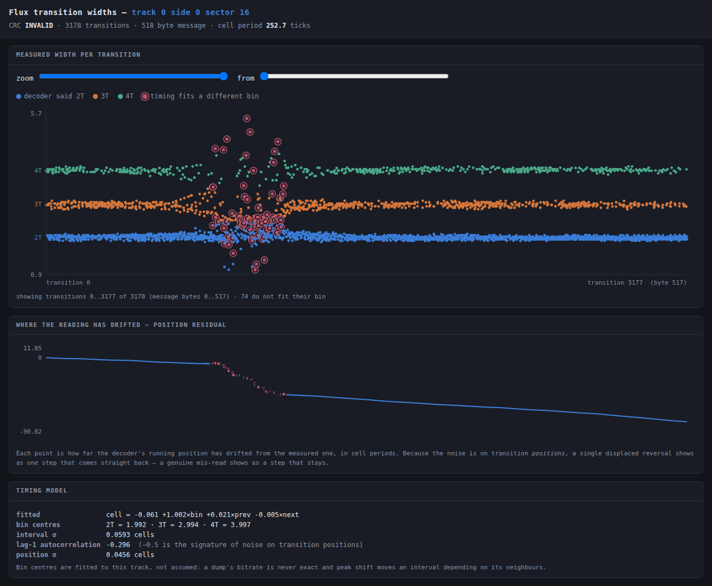

# DisketteRecover

CRC-guided, flux-level repair of floppy disk images, built on the
[HxC Floppy Emulator library](https://github.com/jfdelnero/HxCFloppyEmulator)
(the same `libhxcfe` that the
[Flathub HxCFloppyEmulator app](https://github.com/flathub/fr.free.hxc2001.HxCFloppyEmulator)
ships).

A floppy sector ends in a 16-bit CRC. When that CRC fails, every existing
tool tells you the same thing: *bad sector*. But the disk usually is not
badly wrong - it is slightly wrong, in one or two bit cells, and the raw
flux dump often still says exactly where. DisketteRecover finds that
place, shows it to you at the level of individual flux transitions, and
searches for the smallest, most plausible correction that makes the CRC
come out clean again.

Everything is done through libhxcfe, so the ~100 image formats it reads
and writes come for free, and every repair is verified by re-running
HxC's own decoder over the patched track.

```
$ disketterecover scan   dump.scp        # where are the CRC errors?
$ disketterecover inspect dump.scp       # zoom into the first one
$ disketterecover repair dump.scp        # rank the plausible corrections
$ disketterecover serve  dump.scp        # ...or do it in a browser
```

---

## What it actually does

### 1. Find the first invalid CRC

`scan` walks every track and side, decodes ISO/IBM MFM and FM sectors
through libhxcfe, and reports the address-mark CRC and the data-field CRC
for each one.

```
 idx  trk sd  ord   id  size  enc      hdr-crc  data-crc  data-cell
 ---- --- --  ---  ---  ----  -------  -------  --------  ---------
    4   0  0    4    5   512  ISO/MFM  ok       ok            45344
    5   0  0    5    6   512  ISO/MFM  ok       BAD           55872  <--
    6   0  0    6    7   512  ISO/MFM  ok       ok            66400

1 sector(s) with a CRC error; first is index 5 (track 0 side 0 sector 6)
```

### 2. Show the stream data for that sector

`inspect` (and the browser view) opens the sector's CRC-covered message -
the sync bytes, the data mark, the data, and the stored CRC - and lines
it up against the bit cells and the raw flux transitions underneath.

For every flux interval you get the measured length in cell periods, the
bin the PLL put it in, and how close it came to the boundary between
bins:

```
  bit    byte  role  bitpos  cell    state  interval      bin   margin  p_err   evidence
  2124   265   data  4       7481    0       3.013T/1506  2     0.000   0.49    flux #####
  2127   265   data  7       7487    0       4.161T/2081  3     0.000   0.49    flux #####
  2128   266   data  0       7489    0       0.738T/369   4     0.000   0.49    flux #####
  2130   266   data  2       7493    0       2.012T/1006  3     0.000   0.49    flux #####
```

A 0.738T interval that had to be called a 4T is not a measurement - it is
a guess, and that is where the sector broke.

### 3. Bin the transitions and assign probabilities

Each flux interval is divided by the local cell period and compared with
where a 2T, 3T or 4T interval *actually lands on this track* - which is
not 2.0, 3.0 and 4.0. Two effects move the bin centres:

* the dump's bitrate estimate is never exact, and
* **peak shift** - adjacent reversals repel each other, so a 2T following
  a 4T reads long and the next one reads short.

So the centres are learned rather than assumed, by a robust fit of

```
measured_cells  ~  a + b*bin + c*previous_bin + d*next_bin
```

On a real KryoFlux dump this comes out at `cell = -0.18 + 1.033*bin` with
a residual sigma of **0.075 cells**. Scoring against the ideal 2/3/4
instead would call a sixth of a perfectly good track ambiguous.

Each interval then gets a posterior over the three legal bins,

```
p(bin = k)  =  softmax( -(measured - centre_k)^2 / 2*sigma^2 )
```

and `1 - p(the bin the decoder chose)` is its error probability. That
probability is spread across every cell the interval covers - any of them
could have carried the reversal - and each decoded bit inherits the
combined probability of the two cells that produce it. Cells libhxcfe
flagged as weak are floored at a high probability, unless the flag fires
so widely that it carries no information. Anything below `--threshold` is
**assumed good** and is left out of the search.

The residuals of a real dump are near-Gaussian out to about 4 sigma and
then break cleanly into a separate population of genuine mis-reads, so
that is where the defect detector draws its line.

### 4. Four engines, ranked on one scale

There are several ways to make a sector's CRC come out right, and they
suit different damage. `--mode auto` (the default) runs them all and
scores their answers against each other on a single scale, so the engine
that happens to answer first does not win by default.

**Restoring the data's own regularity** (`--mode pattern`). Sector data
is very often not random, and it is regular in two different ways, so the
engine fits both and keeps whichever describes the field better.

*Repeats.* A freshly formatted MS-DOS disk is 512 bytes of `0xF6`, an
unused directory block is `0x00` or `0xE5`, a padded tail repeats. When
506 of 512 bytes read `0xF6` and the other six are each `0xF6` with a
single bit missing, Occam has already answered the question and the CRC
only has to confirm it.

*Counters.* Index tables, timing lists, sector maps and directory offsets
are all fixed-size records holding a number that goes up by a constant.
Modelling the record as one integer rather than as independent byte
columns is what makes the carries come out right - and getting carries
wrong is not a small error, it is how a search talks itself into a
thirty-byte answer (see below). Record **alignment** matters as much as
record size: a table of 24-bit counters that starts one byte into the
field looks, column by column, like a bizarre byte permutation; lined up
on its real boundary it is plain little-endian with a constant step.

Either way the engine lists the bytes that break the model and enumerates
by how few of them it has to leave broken. It needs no flux at all, and
when it fires it is by far the most decisive thing available.

**Letting every pass vote** (`--mode revs`, whenever the dump holds more
than one revolution). A KryoFlux or SuperCard Pro dump normally holds the
same track read five times round. libhxcfe decodes each pass, scores them
by how many sectors came out with a good CRC and hands back the winner;
for a sector that no pass got right, everything the other four saw is
thrown away, and it is exactly the evidence worth keeping. What the extra
passes are and are not good for is
[section 4b](#4b-what-the-other-revolutions-are-actually-good-for).

**Re-binning the flux** (`--mode rebin`, whenever there are timings and
the track is MFM). Real disks rarely lose a bit outright; they put a
reversal in the wrong bin, and the failure conserves something. See the
next section.

**Bit flips** (`--mode bits`). A CRC is affine over GF(2): flipping
message bit *p* always XORs a fixed mask into the CRC, whatever the data
is. So repairing a sector is finding a set of bits whose masks XOR to the
current syndrome - a hash lookup rather than a re-computation per trial.

* weight 1 and 2 are searched **exhaustively** over the whole field, so
  this works even on images with no timing information at all;
* weight 3 and up enumerate the least trustworthy bits and let the hash
  supply the remaining one;
* the search stops at the first weight that yields a CRC-valid reading;
* every survivor is re-verified by actually recomputing the CRC.

This is the fallback, and the right tool for an isolated error on an
image that carries no other evidence.

Whichever engine runs, its results are re-scored by the same data model
before ranking, so a reading that turns a run of `0xF6` into noise ends
up where it belongs even when its CRC checks perfectly.

### 4b. What the other revolutions are actually good for

The obvious thing to do with five reads of the same sector is to vote on
the decoded bytes. On these dumps that is usually the wrong move, and
measuring why is what the engine is built around.

**The reversals do not move.** Aligned pass against pass with an
alignment that is free to insert and delete reversals, two revolutions of
the same sector agree on the length of *every* interval to about 0.03 of
a cell. On eight of Disk 2's nine bad sectors the passes dispute at most
two reversals out of three thousand, and on six of them not one. That is
not a surprise once stated: the reversals are magnetised into the oxide,
and reading them again reads the same magnets.

**The decode does move - a lot.** The same five passes of Disk 2's
track 0 side 0 sector 16 decode to byte strings that differ in 385 of 518
places, and to five *different* stored CRCs (C017, F000, 3FC0, 3FC0,
02FA). Nothing about the disk changed between those reads. What changed
is where libhxcfe's PLL happened to slip, and once it slips a cell every
byte after it is shifted.

So voting on bytes would be voting on the PLL's opinion, which is the
part that is unreliable, and throwing away the flux, which is the part
that is not. The combining happens on the flux instead, before anything
is decoded: align, average the intervals the passes agree on - which
divides read noise by the root of the count - and *count the reversals
they do not agree on*.

That count is the thing no single pass can produce, and it separates two
failures that look identical from one read:

```
sector      passes  disagree by   contested reversals
0/0 s15        5/5    0.034 cell            0
0/0 s16        5/5    0.021 cell            2
0/0 s18        5/5    0.029 cell            0
0/1 s18        5/5    0.082 cell          239      <-- weak bits
41/1 s17       5/5    0.030 cell            0
```

Every sector but one has flux the passes agree on completely: the damage
is in what was written, permanent, and a search over readings is the
right response. `0/1 s18` is a different animal - a fifth of a cell of
disagreement and 239 reversals that some passes see and others do not.
That is the read amplifier firing on noise, which is what unmagnetised or
half-erased media looks like from the outside, and no amount of analysis
of a single pass can tell it from a clean read. Those cells are marked
`dissent` in the zoomed view and priced by the vote, not by the timings.

The engine then takes the reading the passes vote for - which is a
different, better-evidenced reading than the one pass libhxcfe picked -
and searches outwards from it by reversing the least lopsided votes
first, on the grounds that a 3-2 vote is barely a vote and the CRC is a
better arbiter than one extra pass.

**What it does not do.** On these two disks it repairs nothing new. It is
worth being exact about why, because the reason is interesting: on
`0/1 s18` the passes read the sector's English text visibly better than
the one libhxcfe chose -

```
pass 1  terested in li#ensing the deD..(garbage)      <- libhxcfe's pick
pass 3  terested in licensing the design tO e re
pass 4  terested in licensing the d%sign to a re
vote    terested in licensing the design to ...
```

- but the damage runs from byte 244 to the end of the sector, and a
16-bit CRC cannot arbitrate 274 bytes. The right conclusion is not that
the sector is nearly recovered; it is that half of it is gone, and the
tool now has the evidence to say so instead of returning 256 equally
plausible fictions.

### 4a. What MFM's three interval widths actually buy you

MFM writes exactly **three** interval lengths. Between one magnetic
reversal and the next there are 2, 3 or 4 cell periods and nothing else -
4 us, 6 us or 8 us on a 250 kbit/s DD disk. So the flux really is a
ternary symbol stream, and it is tempting to count redundancy from there:
a byte is roughly six intervals, 3^6 = 729 possibilities for 256 byte
values, so surely there is a factor of ~3 of redundancy to exploit.

It is a good instinct, but the arithmetic does not survive contact with
the encoding, and the redundancy that *does* exist is somewhere else -
somewhere more useful.

**A byte is not a fixed number of intervals.** Eight data bits occupy 16
cell periods, and the intervals tiling those 16 cells vary in number:
between four (4+4+4+4) and eight (2 x 8), averaging 16/3 = 5.33. There is
no fixed-length symbol to count.

**The tilings are fewer than the bytes, not more.** There are exactly
**165** ways to tile a 16-cell window with parts of 2, 3 and 4 - fewer
than the 256 values a byte can take. The shortfall is not a paradox: the
tiling of one byte is not independent of its neighbours. The last data
bit of the previous byte decides where this byte's first reversal can
fall, so the mapping is a state machine, not a per-byte code.

**The real combinatorial redundancy is small.** MFM's cell stream obeys
the (d=1, k=3) run-length constraint: at least one and at most three zero
cells between reversals. That constraint has a Shannon capacity of
**0.5515 bits per cell**, and MFM carries exactly 0.5 - so it is 90.7%
efficient, and the spare capacity is only **0.82 bits per byte**. Not a
factor of three. MFM is a *good* code; there is not much slack left in
the symbol alphabet.

**But there is a conservation law, and it is worth far more.** When a PLL
mis-bins an interval it does not lose the time - it takes it from the
next interval. A true (4,2) reads back as (3,3). The pair still spans six
cells. And downstream of the error the byte grid still framed correctly:
the sync was found, the sector ended where it should. So *the cell count
across a disturbed stretch is known*, even when the individual intervals
inside it are not.

That is the constraint DisketteRecover enforces. A candidate re-reading
must

* give every interval a legal length (2, 3 or 4 cells), and
* span exactly the cells the original reading spanned.

Together those two rules cut the search space down enormously - far more
than the 0.82 bits per byte of alphabet redundancy would. On the real
disk below, they take a stretch the decoder read at a timing cost of 1711
nats down to 429, and pin the damage to fifteen specific interval pairs.

The engine also models the two other physical failures, because both
conserve cell count in the same way:

| failure  | what the flux shows              | what the search does        |
|----------|----------------------------------|-----------------------------|
| mis-bin  | adjacent intervals off by +1/-1  | re-bin the pair             |
| dropout  | one interval covers two real ones| split it, at a fixed penalty|
| spurious | two intervals cover one real one | merge them, likewise        |

Each disturbed stretch is solved independently by a shortest-path search
over its legal re-readings, and the stretches are then combined in cost
order and tested against the CRC.

### 4d. The referee above the sector

A sector CRC is sixteen bits of evidence about five hundred and twelve
bytes, and this project spent a long time treating it as the arbiter of
truth. It is not, for two reasons that turn out to matter on real disks.

The first is that it is often destroyed along with the data. The two CRC
bytes are the last two bytes of the sector and nothing protects them; on
every disk here where a mark ran off the end of a sector it took them
with it. `crc_expected_errors` measures that, and it is cleanly bimodal:
0.006 bits in doubt on an intact sector, 0.36 to 4.9 on a damaged one.
When the CRC is a guess, every "CRC-valid" reading is matching a number
that was never on the disk.

The second is that sixteen bits are not many. Search far enough and
hundreds of readings satisfy them. On Sand's `27/1 s10` the search finds
**245** CRC-valid readings, the best only nine times likelier than the
next. Sixteen bits cannot separate those, and no amount of cleverer
ranking will change that - the information is not there.

What *is* there, and what nothing in this program was using, is the
filesystem. `--fs` reads it, and it changes the question from "which
reading satisfies the checksum" to "what is this sector, and who can
check it".

```
$ disketterecover scan "Disk 2/track00.0.raw" --fs
filesystem: FAT12, 18 sector(s)/track, 2 head(s), 2 FAT(s) of 9 sector(s), 8 file(s)
            the two FATs differ in 388 byte(s)

where the bad sectors land
    0/0 s15   FAT       FAT copy 2, sector 4 of 9 - the other copy of these same bytes reads clean
    0/0 s16   FAT       FAT copy 2, sector 5 of 9 - the other copy of these same bytes reads clean
    0/0 s18   FAT       FAT copy 2, sector 7 of 9 - the other copy of these same bytes reads clean
    0/1 s18   free      cluster 4 - free space: no file's data is here, so nothing was lost
   41/1 s17   file      cluster 1479 - bytes 34816..35328 of FHP2_97.QBB (118575 bytes)
   ...
of 9 bad sector(s): 3 in a FAT (3 with a clean second copy on this disk),
1 in free space, 0 outside the filesystem, 5 carrying 2560 byte(s)
of a file.
```

Four things fall out of that, in rising order of how much they change.

**Some sectors hold nothing.** Disk 1's two failures, GasAcc's one and
one of Disk 2's are in free space: no file's data is there. Ron's
twenty-two are not even inside the filesystem - they are noise on track
80, past the last formatted track, decoded as 16 KB FM sectors. Those
disks were never damaged in any sense their owner would recognise, and
saying so is more useful than repairing them.

**A FAT is written twice.** `--from-copy` writes the other copy's bytes
and re-stamps the CRC. On Disk 2's `0/0 s15` the copy from FAT1 has CRC
`7D26` - which is exactly the value stored on the damaged sector. That
is not a ranking, it is a match: eight bytes recovered, confirmed by
sixteen bits the search never got to choose. The other two FAT sectors
take the same bytes; there the stored CRC went with the data, so they
are recovered by redundancy rather than proved by checksum, and the tool
says which is which.

**A file can check itself.** A ZIP entry carries a CRC-32 of what it
unpacks to, and a deflate stream that has been touched by one bit almost
never inflates at all. So `--fs` puts every candidate reading to the
file's own checksum:

```
referee   : what the file above this sector makes of each reading
            245 reading(s) satisfied the sector's 16-bit CRC; none of them
            survives the file's own 32-bit one. The true reading is not in
            this pool - the damage is deeper than the search can reach.
```

That verdict was not previously available at any price. It is the
difference between applying the top candidate and knowing it is wrong.

And it is not a theoretical worry. The regression suite builds a FAT12
disk with a ZIP on it, drops two reversals inside the deflate stream,
and then checks the answer against the original bytes:

```
  ok   many readings satisfy the 16-bit sector CRC (250)
  ok   exactly one survives the file's CRC-32
  ok   the survivor is not the top-ranked reading (#8)
  ok   and it is the original data, exactly
```

250 readings satisfy the sector. One satisfies the file. It is candidate
**#8** - the likelihood ranking put seven wrong answers ahead of it, and
every one of those seven would have been applied and verified "clean".
The ranking is not broken; sixteen bits simply do not contain the
answer, and no amount of better ranking can conjure it. Thirty-two bits
about the data do.

**And archives get written twice too.** Sand carries `CONTAC~1.ZIP` and
`CONTACTS.ZIP`: two backups of the same folder, a few weeks apart,
sharing a hundred and one entries whose packed bytes are byte-identical.
Three of Sand's four bad sectors sit inside entries that also exist in
the sister archive. `--from-copy` finds them, splices, inflates, and
checks the CRC-32:

```
second copy: 'faxcover.adt' is archived twice on this disk; the copy in
CONTACTS.ZIP inflates and matches its CRC-32 (3C4E1290) - proven
```

Ninety-eight to a hundred and three bytes per sector, recovered exactly,
on damage far too deep for any bit-flip search - and proved by
thirty-two bits about the data the owner cares about rather than sixteen
about the sector. All three of those sectors were previously
unrepairable.

The damaged ranges are worth reading too: bytes 414-511, 408-511,
403-511. Every one of them runs to the end of the sector. That is the
radial mark again, and it is why the sector CRC could never have
arbitrated: the mark eats the CRC on its way past.

**And a document keeps its own second copy.** A PowerPoint 97 file
saved for backwards compatibility is a little filesystem in its own
right, and it holds the whole presentation twice - once live, once
inside a storage called `PP97_DUALSTORAGE` for PowerPoint 95 to read.
The preview thumbnail goes in twice with it. Zeus's `9/0 s9` landed in
one of those two copies:

```
filesystem: FAT12, 18 sectors/track, 2 head(s), 8 file(s) - this is LBA 332
            cluster 301 - bytes 82432..82944 of ZEUSNO~1.PPT (87040 bytes)
            compound document: stream 'SummaryInformation', bytes 5632..6144 of 9448

second copy: 'SummaryInformation' is stored twice in this file; the twin matches
for 8581 byte(s) either side of the damage, and with its 512 bytes in place, its
preview metafile: every record tiles exactly after 727 record(s)
```

Two independent things agree there. The twin matches for 8581 bytes
either side of the gap, and the thumbnail is a Windows metafile - a
chain of records each declaring its own length, which has to tile the
stream exactly. As read, that chain breaks at record 416, seventy-four
bytes into the damaged sector. With the twin's bytes in, all 727
records land precisely on the last byte.

That is also where the sector CRC is caught out. The recovered bytes
give a CRC-16 of `239E`; the disk has `473C` stored - six of the sixteen
bits are wrong, and the flux model put the expected number of bad CRC
bits at 0.006. Band collapse is *bias*, not ambiguity: every interval
sits comfortably near a bin centre and scores as certain while being
wrong. Which is exactly why every one of the 337 re-binnings that
satisfied that CRC is refuted by the file, and why the other Zeus
sector - in the PowerPoint 95 copy, where there is no twin - stays
unrepaired rather than getting the likeliest of 563 wrong answers.

The tool names which of the two copies was hit, because that is the
difference between a lost presentation and a lost compatibility copy.
On Zeus it is the compatibility copy: the deck itself opens fine.

**And what the owner still has is not the same question as how many
sectors read.** `scan --fs` surveys the disk file by file, and for an
archive it checks each member separately - by its own local header,
never through the central directory, because the directory is the last
thing in the file and a mark near the outside of the disk eats it:

```
the files on this disk
  TESTPL~1.XLS      53760 byte(s)  no bad sector - intact
  TRAVEL~1.ZIP      87514 byte(s)  damaged - 6 of 9 archive member(s) still extract
```

Eleven bad sectors on that disk, all of them in the one archive, and
most of it comes out anyway. A reader that trusted the central
directory would have reported the whole thing as empty.

**And then the directory again, because it is worth something after
all.** An archiver that rewrites a file leaves the old central directory
behind in the middle of it, so a damaged archive often carries a
*second* copy of its own catalogue in a part of the disk the mark never
reached. That copy no longer says where anything is - the offsets are
from the old layout - but it still says what the archive contained, how
long each member is packed, and what its contents must check to. Given a
length and a CRC-32, the data can simply be hunted for: try to inflate
that many bytes from every offset and see which comes out right. Thirty
two bits make a false positive impossible in a file this size.

```
TRAVEL~1.ZIP  87514 byte(s)  damaged - 8 of 11 archive member(s) still extract
(2 of them found through a second copy of the archive's own directory);
lost: TransportImg.gif, TravelPalReadme.html, AutoRentImg.gif
```

On SLAT that finds a member whose own local header had been overwritten
- and finds it twice over, because the archive had stored the same
animation under two names, `RotatingGlobeAnimation.gif` and
`RotGlobeAnim.gif`, with identical packed bytes and identical CRC-32.
The stale directory is the only thing on the disk that knows the second
name exists.

It also settles what the damage actually cost. Of those eleven bad
sectors, **eight lie inside no archive member at all** - they are in the
38 KB of the file that the current layout does not use, left over from
the earlier version. Of the three that do land in a member, one
(`CityDialogImg.gif`) still inflates and matches its CRC-32, so that
sector's data was right all along and only its stored CRC was chewed;
one is the globe, recovered; and one, `TransportImg.gif`, is genuinely
gone. Eleven unreadable sectors, one lost file. The other two names in
that "lost" list fail with no bad sector anywhere near them: they are
stale headers from the old layout pointing at data that was overwritten
long before this disk was ever read.

**A copy from elsewhere.** `--from-file COPY` takes the same file from
another disk, an archive, a download. On LGTC0 it recovered both damaged
sectors of `IFSMGR.VXD` outright, and the repaired file is byte-identical
to the known-good build across all 185,910 bytes - see
[the repair that was wrong](docs/disks.md#the-repair-that-was-wrong-and-how-we-know),
because one of those two sectors had already been "repaired" by the
search, at a margin of 102x, and was wrong. It will not be laid out the same
way, so the damaged sector's known-good neighbours are the anchor: find
where they occur in the candidate, demand a long run of agreement on
both sides, and then let the sector's own CRC say whether the bytes
between them are right. A copy that does not line up is refused rather
than forced:

```
IFSMGR.VXD does not line up here - the best match agrees for only 0 byte(s)
before and 0 after, so it is a different build or a different file
```

To make that less of a lottery, `--fs` says which build to go and find:

```
'IFSMGR.VXD' is 185910 bytes, version 4.90.3000,
Copyright (C) Microsoft Corp. 1988-2000 - find that exact build and
--from-file will use it
```

**A deleted file is not gone.** Erasing a file on a FAT disk overwrites
one byte of its name and frees its clusters; the length, the start and
very often the data are all still there. That is the same kind of
evidence as a stale archive directory, so `--fs` lists those entries too,
and says whether anything has taken the clusters back:

```
  ?PN.PRC     36099 byte(s)  deleted; 36352 byte(s) of its chain still
                             readable - its data may still be there
  ?LEX.PPT   714240 byte(s)  deleted; 15872 byte(s) of its chain still
                             readable - its clusters have been taken back
```

It also says when two live files claim the same clusters, or when a
file's chain gives out before its recorded length - both of which mean
the filesystem is wrong about something quite apart from any bad sector.

And `extract --deleted` writes them out. On ALXPPT that recovers three
PalmOS databases whose directory entries had been erased. A `.prc` or
`.pdb` describes itself - a name, a record count, and a list of offsets
that have to rise and land inside the file - so the tool can say more
about them than any sector checksum could:

```
  RPN.PRC        36099 byte(s)  PalmOS resource database 'RPN' (appl/Yrpn):
                                all 12 resource offsets rise and land inside the file
  TEALLOCK.PRC   26056 byte(s)  PalmOS resource database 'TealLock' (appl/TlLk):
                                all 38 resource offsets rise and land inside the file
```

In all three the last record ends *exactly* on the last byte of the
file, which is a few dozen constraints satisfied at once.

Note the names. The directory could only offer `?PN.PRC` and
`?EALLOCK.PRC`, because the byte DOS destroys when it erases an entry is
the first letter of the name. The name *inside* each file puts it back,
and only when the two agree on everything else - so `RPN.PRC` and
`TEALLOCK.PRC` are restored, while a third file whose internal name is
`Yrpn_R_WScripts` keeps its question mark rather than being given a
letter it has not earned.

**And not every floppy is a PC floppy.** A Macintosh HFS volume has no
FAT and no 8.3 directory, so the FAT reader saw nothing and the whole
account above the sector went quiet - on a disk that turned out to have
no errors at all. HFS's catalogue is a B-tree and is not walked, but its
volume bitmap is one flat run of bits and answers the question that has
settled more bad sectors here than any search: is anything stored in
this block at all?

```
filesystem: HFS (Macintosh), volume 'Gradebook', 2 file(s) and folder(s),
            2874 allocation block(s) of 512 byte(s)
```

### 4e. Five images, and letting a person look

When several readings survive, `--variants 5 --out disk.hfe` writes
`disk_a1.hfe`, `disk_a2.hfe` ... one image per reading, each with its
data written in and its CRC re-stamped so every one of them mounts
clean. Open them in a disk browser and the one whose files still make
sense is the true reading.

Where the file format carries a checksum, the tool does that looking
itself and labels the variants; where it does not - QuickBooks backups,
PowerPoint 97, a Windows VxD - a person with the files in front of them
is still the better referee, and five files to click through settles in
seconds what a likelihood ratio only ever estimates.

### 5. Cycle through the most likely corrections

Whichever engine ran, the results come back ranked - by the product of
the flipped bits' error probabilities for a bit-flip search, or by how
well the re-reading explains the measured timings for a re-bin. The most
plausible reading is first; `--apply K` takes the Kth.

Press `next candidate` (or `n`) in the browser to step through them; the
flux strip and the hex dump update to show the reading each one implies.

### 6. Write the corrected image back

`apply` patches the bit cells in the track - re-encoding the affected
bytes so the MFM clock cells stay legal - then re-runs libhxcfe's decoder
over the patched track and reports whether the sector now reads clean.
`--out` exports through any libhxcfe writer (`disketterecover formats`),
so you can go back out to HFE, IMG, SCP, IPF, ...

---

## The honest limitations

A 16-bit CRC pins a 512-byte sector down to one part in 65536. A data
field offers a few thousand places to flip a bit, so **alternative
readings that also satisfy the CRC are normal, not exceptional** - a
three-bit error will quite often have a one-bit alias.

DisketteRecover therefore does three things rather than one: it tells you
how much the top candidate wins by, it tells you when the ranking is
meaningless, and it tells you when the CRC simply does not carry enough
information to settle the question.

```
margin    : the top candidate is 1.75e+03 x more likely than the next; clear winner
```

```
budget    : 108 message bit(s) still in doubt across the disturbed region;
            a 16-bit CRC pins down 16, so expect ~5e+27 reading(s) to pass it
```

```
note      : no flux timing in this image, so every bit carries the same prior.
            Candidates of equal weight cannot be told apart; the lowest weight
            is not necessarily the true error. Re-dump as flux (SCP/KryoFlux/A2R)
            to get a real ranking.
```

The ranking is only as good as the evidence. On a sector-level image
(IMG, HFE, ADF) there is no timing to bin, every bit gets the same prior,
and all the tool can offer is "here are the minimum-weight readings".
On a flux dump (SCP, KryoFlux stream, A2R, DFI, MFI, HxC stream, FDX) the
margins are real and an isolated defect is usually resolved by a wide
margin.

Currently supported encodings for repair: **ISO/IBM MFM** (System 34, the
PC/Atari/Amstrad family) and **ISO/IBM FM** (System 3740). Re-binning is
MFM-only. Amiga MFM uses a checksum rather than a CRC-16 and is not
handled yet; nor are the GCR formats.

And the limit that the revolutions made explicit: **nothing protects the
CRC bytes.** They are two bytes of the sector like any other, so a sector
damaged near its end has a *stored* CRC that may itself be wrong, and
then every "CRC-valid" reading the search returns matches a target that
was never on the disk. On Disk 2's `0/1 s18` the five passes decode to
five different stored CRCs. Where the passes read the CRC bytes
differently from the reading being repaired, the tool now says so and
labels the whole candidate list as evidence of nothing.

### A worked case: four real KryoFlux dumps

**Disk 1** - an 84-track dump of a 720K disk, 1440 sectors, two bad:
sector 6 on side 1 of tracks 72 *and* 73. The same sector on adjacent
tracks is the signature of a physical mark rather than a random error.

The flux said the damage was a mess. `inspect` fits the track timing to
sigma 0.075 cells and finds a 70-byte stretch where intervals sit 10 to
16 sigma from any legal bin centre, in adjacent pairs of opposite sign:

```
  cell  6187 (byte 386)  gap 4  meas  2.846  z  -15.82
  cell  6189 (byte 386)  gap 2  meas  3.238  z  +16.03
  cell  6266 (byte 391)  gap 3  meas  3.849  z  +11.25
  cell  6269 (byte 391)  gap 3  meas  2.173  z  -11.63
```

Fifteen such pairs. Re-binning them cuts the region's timing cost from
1711 nats to 429 - a real improvement - but leaves about a hundred bits
in play, and sixteen bits of CRC cannot choose among 2^92 readings. The
flux alone does not settle it.

The data does, instantly:

```
data      : period 1 explains 98.8% of the field (3 distinct values,
            commonest 0xF6 x506)
search    : restoring the repeat - 6 byte(s) break it; 1 reading(s) tested
result    : 1 CRC-valid reading(s) from the data model

 rank  bytes  bits  restore  remove  data evidence  changed bytes
    0      6     6        6       0      37.5 nats  382:76->F6, 383:76->F6,
                                                    391:F2->F6, 398:76->F6, ...
```

506 of 512 bytes are `0xF6` - the MS-DOS `FORMAT` filler - and the six
exceptions are `0x76` and `0xF2`, each `0xF6` with exactly one bit
missing. The whole sector is `0xF6`; the stored CRC `2BF6` confirms it on
the first reading tried. Both sectors, byte-exact, applied and verified
by libhxcfe's own decoder.

**Disk 2** - a 1.44 MB dump, 2882 sectors, nine bad, and this time the
sectors hold real data rather than filler. Four repair uniquely; the rest
stay ambiguous and are reported as such rather than guessed.

The first of them, track 0 side 0 sector 15, is worth following through.
The flux says the damage runs from byte 182 to byte 255 - intervals 10 to
16 sigma from any legal bin centre, a `2.08T` called a 4T next to a
`3.42T` called a 2T. Re-binning narrows it but cannot settle it. The data
is what settles it:

```
data      : 3-byte little-endian records at offset 1 counting by 0x2002,
            over 510 of 512 bytes - explains 97.6% of the field
search    : restoring the repeat - 12 byte(s) break it; 794 reading(s) tested
result    : 1 CRC-valid reading(s) from the data model
budget    : 794 reading(s) were possible; a 16-bit CRC passes ~0.0121 of them
            by chance, so the single survivor is ~98.8% likely to be right

 rank  bytes  bits  restore  remove  data evidence
    0      8    13       13       0      70.0 nats
```

Thirteen bits, every one of them a reversal put back, every one inside
the span the flux independently flagged.

That sector is also where an earlier, sloppier version of this engine
went wrong, and the failure is instructive. Modelling the record as three
independent byte columns made the high byte look constant, so every
legitimate carry looked like an error - 34 outliers instead of 12. Given
34 free bytes, the search duly produced a CRC-valid reading that changed
30 of them, most at the carry points. It was nonsense, and it was
*guaranteed*: 2^34 candidates against a CRC that accepts one in 65536
will always turn something up. **The number that matters is not whether a
reading passes the CRC but how many readings were on offer** - which is
why the tool now reports exactly that.

One of the still-unrepaired sectors is a word-processor document, and
there the data model speaks for itself - the top four candidates all
agree on:

```
byte 218: 0x23 -> 0x63    '#' -> 'c'
  was: "...we are interested in li#ensing the de..."
  now: "...we are interested in licensing the de..."
```

One bit, reading 0 where a 1 was written.

The five passes in the dump then say how far that sector can go. Each
pass reads the text a little differently, and the pass libhxcfe picked is
the worst of the five:

```
pass 1  terested in li#ensing the deD..(garbage)      <- libhxcfe's pick
pass 3  terested in licensing the design tO e re
pass 4  terested in licensing the d%sign to a re
vote    terested in licensing the design to ...
```

Two more words, recovered by letting the passes vote rather than trusting
one of them. And then it stops: from byte 244 to the end of the sector
the passes disagree about 239 reversals - a fifth of a cell of scatter,
which is unmagnetised media, not a mis-read - and the damage takes the
stored CRC with it. 274 bytes, no redundancy, and a checksum that is
itself a guess. That sector is not coming back, and the useful output is
knowing where the recoverable part ends.

**GasAcc** - 2916 sectors, one bad, and it is the sector that taught this
tool the most: see [the one wrong answer](#the-one-wrong-answer-and-what-it-cost-to-find-it)
below. It repairs exactly, to 512 bytes of `0xF6`.

**Zeus** - 2881 sectors, two bad: sector 9 on tracks 8 *and* 9, the same
adjacent-track signature as Disk 1. Both are in the same file - the
filesystem says `ZEUSNO~1.PPT`, 170 sectors of which exactly these two
are damaged - and both fail the same way: band collapse over the first
hundred bytes, gain 0.87 against 1.00 for the rest of the sector, and an
interval spread of 0.15 cells where the bands are only 0.87 apart.

Both stay ambiguous, and the arithmetic says they have to. Thirty-four
intervals are left genuinely open by the timings; the re-binning search
puts twenty million readings on the table and a 16-bit CRC lets about
three hundred of them through. There is no more evidence to bring: the
five passes agree on every reversal to 0.018 of a cell, so the flux has
already said everything it knows, and adding neighbour and interaction
terms to the timing model moves its residual from 0.176 to 0.171. A
sector can be damaged past what its own checksum can arbitrate, and these
two are.

They did pay for themselves, though - see the note on the block fit
below, which they are the reason for.

Totals, now over thirteen disks: 80 bad sectors, of which **50 hold no
file's data at all** - free space, unformatted noise past the last
track, or parts of a file the file itself no longer uses. Of the 30 that
do carry live data, **10 are recovered** - and only three of those by
the search. The other seven came from a second copy of the same bytes:
three from an archive stored twice on the disk, one from a stream stored
twice inside one document, one from a member the archive had stored
under two names (found through the stale copy of its own directory), and
two from a copy of the file supplied from off the disk entirely. Six of
the thirteen disks lost nothing whatsoever.

The count of search repairs went *down* again this time, and not because
the search got worse. An outside copy of LGTC0's `IFSMGR.VXD` arrived
and settled a sector the search had already "repaired" at a margin of
102x. It was wrong. See
[the repair that was wrong](docs/disks.md#the-repair-that-was-wrong-and-how-we-know).

The running tally, and what each disk turned out to be suffering from,
is in [docs/disks.md](docs/disks.md).

That number went *down* as the tool got better, and the reason is the
whole point of the section below. Five of the readings it used to apply
were matching a stored CRC that was itself inside the damage - on Disk
2's `41/1 s17`, about 4.9 of the checksum's 16 bits are in doubt, so
matching it exactly is not evidence of anything. The tool now measures
that and declines. A repair count that only ever goes up is a repair
count that is not being checked.

### The errors that actually happen

Fourteen errors across these two disks have a verifiable truth - eleven
from the all-`0xF6` sectors, three from English prose. **Every one of
them is a 1 read as a 0: a magnetic reversal that was written and not
detected.** None is a spurious reversal, and none is a bit written wrong.

Better still, on Disk 1 all eleven sit at one of two bit positions in the
byte, and those two are exactly the transitions *preceded by a 4T gap*.
If dropouts were spread evenly over the six transitions in an `0xF6`
cell pattern you would expect a third of them there; getting eleven out
of eleven by chance is about one in 180,000. The physics is unsurprising
once stated: an isolated pulse after a long gap is the broadest and
lowest, so it is the first to fall under the detector's threshold on a
weak patch of media.

That gives a usable ranking of causes, most likely first:

| error | mechanism | flux signature | data signature | seen |
|---|---|---|---|---|
| **dropout** | weak pulse misses the threshold, most often after a 4T gap | one interval covers two; the PLL splits it into an implausible pair | a 1 reads as 0 | **14/14** |
| **mis-bin** | PLL steals a cell from the next interval | adjacent intervals off by +1/-1, total conserved | usually one bit | the flux face of the above |
| **shift** | transition displaced but still detected | one interval long, the next short | one bit or none | synthetic only |
| **spurious pulse** | noise clears the threshold | two intervals sum to one legal length | a 0 reads as 1 | **0/14** |
| **speed drift** | motor wow, or a different drive | every interval scales together | none, if the PLL tracks | absorbed by the fitted model |
| **weak / fuzzy bits** | deliberate protection, or unmagnetised media | differs between revolutions | not repeatable | none here |
| **burst / erasure** | scratch or contamination | many implausible intervals over a span | many bits | Disk 1's tracks 72-73 |
| **phase slip** | a burst leaves the decoder a cell out of step | the run either side of it re-bins | *every* byte after it | GasAcc track 74 |
| **band collapse** | head-media separation; bit crowding | 2T and 4T both pulled towards 3T, ~0.3 cell | many bits | GasAcc track 74 |

Across all four disks, 27 bit errors have a verifiable truth and all 27
are reversals that went missing.

The last two are worth separating out, because between them they produced
the one confidently wrong answer this tool has given.

**Band collapse.** On GasAcc's track 74 the bin centres move *within* a
sector. Over bytes 331-515 a 2T next to a 4T reads 2.46 cells and a 4T
between 2Ts reads 3.59, against 2.10 and 3.90 in the clean part of the
same sector; the gain falls from 1.00 to 0.83 and the neighbour terms
triple. Both bands are pulled towards the middle, which is peak shift -
adjacent transitions repelling each other - getting three times worse
over a stretch. Head-to-media separation does this: the read pulse
broadens, and a broader pulse leans on its neighbours harder.

The model is therefore fitted **per region**, over overlapping blocks of
a few hundred intervals, and that turns out to matter for every sector
and not just the collapsed one. Fitting one set of coefficients across a
sector with a bad patch makes the single answer wrong at both ends: on
GasAcc's sector the global fit reports sigma 0.165 cells, where the
intact three quarters of that same sector measures 0.055. Every interval
in the good part was being judged against noise three times its own, and
every marginal call it produced was manufactured.

Blocks overlap by half so the coefficients interpolate rather than step,
and a block only keeps its own fit if the gain stays inside [0.75, 1.25]
*and* the local residual beats the global one on those same intervals -
measured on the same intervals, too, or the trimmed local figure is being
compared against an untrimmed global one and wins by bookkeeping.

The window the block fit trims against has to come from the block, not
from the sector. Deriving it from the global sigma looks careful and is
self-defeating: a block whose bands have collapsed sits half a cell from
where the global fit expects it, so every interval in it falls outside a
window scaled to the clean three quarters of the sector, the block is
left with nothing to fit, and *the one stretch that needed a local model
is the one stretch that never gets one*. That is how Zeus's bad sectors
were reported as running at gain 0.99 throughout when their first three
blocks are 0.90, 0.87 and 0.93. The window now starts at half a cell and
tightens from the block's own spread.
Outside that, the global centres stand and the block keeps its own larger
residual - so a stretch with nothing readable left reads as exactly that,
rather than having a flattering model fitted to its noise. This is the
opposite failure from the one above and just as easy to walk into: a
local model that can explain anything explains away the damage too.

The gain spread across blocks is reported, and it separates the failures
cleanly - GasAcc's bad sector runs 0.754 to 0.986 while Zeus's run 0.988
to 1.016. The sharper evidence is worth real candidates: on Disk 2 it cut
sector 42/1 s17 from two CRC-valid readings to one, and lifted 9/0 s9 on
Zeus from 3 times the runner-up to 51.

**Phase slip.** Give a run of intervals one cell too many and the byte
boundary moves. Nothing is corrupted; everything after is *re-framed*. On
GasAcc that turned a sector of `0xF6` filler into a long run of `0xBD` -
and `0xBD` is not a corruption of `0xF6`, it is the same cell pattern
read four cells later. No number of bit flips repairs that, which is the
whole point: a search that only flips bits cannot even represent the
answer.

Two things follow, and both are built in. `--restore-only` searches only
for reversals to put *back*, which is what the evidence says errors are;
it also cuts a weight-3 search roughly eightfold. And `--dropout-bias`
tilts the ranking that way without forbidding the alternative.

### The one wrong answer, and what it cost to find it

GasAcc has a single bad sector. The tool repaired it, reported a margin
of 340 to 1, and re-decoded it clean. The answer was wrong.

The sector is 512 bytes of `0xF6` filler with a burst defect two thirds
of the way in. The defect left the decoder four cells out of step, so the
last 180 bytes read as a run of `0xBD` - re-framed, not corrupted - and
*the last two bytes of the sector are the CRC*. Nothing protects them.
The stored value came back `8AFD`; the true CRC of an all-`0xF6` sector
is `2BF6`. The search was matching a target that had never been on the
disk, and with 180 damaged bytes to play with it found a three-bit flip
that hit it. One in 65536 is a long shot; one in 65536 across millions of
readings is a certainty.

Three things were wrong and all three are now fixed.

**The data model gave up too early.** `--max-outliers` bounds the
*enumeration* - how many combinations of "leave this byte broken" to try
- and it was also gating the single reading that leaves none of them
broken. That reading is one trial however many outliers there are, and it
is the one Occam nominates, so it is now always tried.

**A degenerate model was outscoring the true one.** A counter with step
zero is a repeat, and it was winning by *abstaining*: it declined to
predict the 82 bytes it found awkward, which flattered its coverage to
99.5% while explaining fewer bytes than the plain repeat it was imitating.
Counters with a zero step are now rejected outright - `fit_periodic`
already describes repeats, and it commits to every byte.

**Nothing could express the answer.** A phase slip re-frames every byte
after it; a candidate is a list of bit flips; 180 bytes do not fit in
one. Candidates now carry an optional cell-phase correction, and the
pattern engine searches for one whenever a repeat fits the head of a
field and collapses. On this sector it finds `+4 cells at byte 418`,
recovers 464 of 514 bytes at a stroke, and the remaining 48 are restored
by the model in a single reading. The result is 512 bytes of `0xF6` with
stored CRC `2BF6` - and with the phase put back, the CRC bytes read
correctly on their own, which is as close to independent confirmation as
this gets.

Two guards came out of it, and they are worth more than the sector was.

The first: **a CRC is only evidence if the CRC was read correctly.** The
tool now adds up the error probability of the sixteen stored CRC bits and
reports it, and the figure is cleanly bimodal on real disks - 0.006
expected bad bits where the sector's tail is intact, against 0.36, 3.4,
4.4 and 4.9 where the damage reaches it. Above 0.3 it will not apply a
repair on its own authority, however commanding the margin: a margin is a
ratio against the other readings that matched the stored value, and when
that value is a guess the ratio only says which fiction the priors
preferred. `--apply K` still applies one deliberately.

The second: where a trustworthy model determines the data but the stored
CRC disagrees by a bit or two, the repair may correct *those* bits - and
then says so, and prices the result honestly: two corrected bits widen
the CRC's target from one value in 65536 to 137, and the reported budget
says so.

### Ranking: Occam's razor, made explicit

Every engine's candidates are scored the same way, and the CRC is the
weakest term in it:

```
score = data plausibility  +  flux plausibility  +  error-type prior
```

* **data plausibility** - the log-likelihood ratio of the candidate's
  bytes against a model of what this disk's data looks like, learned
  from every sector that reads cleanly. A whole disk is over a megabyte,
  which supports a real order-2 model; a single 512-byte sector does not,
  which is why the model is built disk-wide.
* **flux plausibility** - how well the reading explains the measured
  interval timings, under the fitted bin centres.
* **error-type prior** - restoring a dropped reversal beats inventing a
  spurious one.
* **burst prior** - an error next to another error is one event, not two.

That last term matters more than it looks. Scoring bits independently at
a 2e-4 error rate says the typical gap between two errors is thousands of
bits, so a five-bit answer is charged as five separate miracles and loses
to any one-bit answer that happens to satisfy the CRC. The disks say
otherwise. Across every fix that has a verifiable truth, 21 of the 22
gaps between consecutive errors are under 160 bits and half are under 16
- and the two ground-truth sectors on Disk 1, whose contents are known
independently of any engine here, show the same clumping on their own, so
it is not an artefact of whatever found them:

```
D1 72/1 s6   gaps   8, 69, 51, 149, 8
D1 73/1 s6   gaps   77, 67, 8, 101
D2 0/0 s15   gaps   14, 1, 3, 1, 3, 1, 8, 155, 149, 15, 1, 58
D2 0/0 s16   gaps   2269
```

Which is physics rather than coincidence: one weak spot in the oxide, one
off-track excursion, one speed wobble takes out a neighbourhood of
reversals, not a bit. So a flip standing `d` bits from the previous flip
is charged at `q * (1 + G*exp(-d/B))` instead of `q`, with `G` = 110 and
`B` = 60 bits fitted to the table above (`--burst-gain`, `--burst-len`;
`--burst-gain 0` turns it off). It does not invent fixes out of nothing -
what it does is stop the independence assumption from throwing away the
right answer, and every confirmed repair on both disks got stronger for
it, Disk 2's counter sector by three orders of magnitude.

A CRC accepts one reading in 65536 by chance. That is plenty when you are
choosing between a few hundred candidates and nothing else to go on, and
useless when a burst puts a hundred bits in doubt. The priors are what
turn "these all pass the CRC" into "this one is the truth", and when they
cannot, the tool says so instead of picking.

## Building

```sh
git clone --recursive https://github.com/stevenggaskill/DisketteRecover
cd DisketteRecover
make
```

`make` builds the pinned HxC submodule (`libhxcadaptor` + `libhxcfe`) and
then the tool. A C compiler, make and zlib are needed; the browser view
is compiled into the binary. zlib is what lets `--fs` inflate a ZIP
entry and check its CRC-32 - build with `CFLAGS=-DDR_NO_ZLIB` and drop
`-lz` from `LDLIBS` to do without it, losing only that check.

```sh
make test        # regression suite, builds its images from the HxC samples
```

## Usage

```
disketterecover <command> [options] <image>

commands:
  scan     <image>              list every sector and flag CRC failures
  inspect  <image>              zoomed view of one sector's cells+bytes
  repair   <image>              search for the most likely CRC-valid fix
  damage   <image>              flip data bits on purpose (test images)
  serve    <image>              browser UI for inspect + repair
  convert  <image>              write the image out in another format
  formats                       list libhxcfe export formats

selection:
  --sector N        sector index from `scan` (default: first bad CRC)
  --track T --side S --id R     select by physical address instead
  --all             work through every sector with a CRC error

engine options:
  --mode M          auto | pattern | revs | rebin | bits (default auto)
                      pattern: restore the repeat the data almost obeys
                      revs   : let every pass in the dump vote on where
                               the reversals are (flux dumps only)
                      rebin  : re-read the flux under another legal
                               binning of the transitions (MFM + flux)
                      bits   : search bit flips (works without flux)
                    auto runs them all and ranks on one scale
  --max-outliers N  pattern engine: bytes allowed off-pattern (24)
  --restore-only    only consider putting dropped reversals back
  --dropout-bias N  nats favouring a restored 1 over a removed one (1.6)
  --burst-gain G    how much likelier an error is right after another
                    one (110; 0 turns the burst prior off)
  --burst-len B     bits over which that lift decays (60)
  --bin-budget N    nats of timing cost a re-bin may spend (12)
  --max-ambiguous N refuse to search past this many open intervals (48)
  --max-explore N   cap on re-binning assignments tested (500000)

model options:
  --threshold P     p_err below this is 'assumed good' (default 1e-3)
  --base-perr P     prior error rate with no timing evidence (2e-4)
  --jitter S        flux jitter sigma in cell periods (0.16)
  --max-weight N    deepest error weight to search (3, max 6)
  --max-pool N      how many low-confidence bits to consider (96)
  --max-results N   cap on returned candidates (256)

repair options:
  --apply K         apply candidate K (0 = most likely) and verify
  --auto            apply candidate 0 only when it clearly wins
  --out FILE        write the patched image
  --format NAME     export format for --out (default: HXC_HFE)

other:
  --set NAME=VALUE  override a libhxcfe setting before loading, e.g.
                    --set FLUXSTREAM_PLL_MAX_ERROR_NS=900 (repeatable)
  --json            machine readable output
```

### Repairing a whole disk

```sh
disketterecover repair "Disk 1/track00.0.raw" --all --auto --out fixed.hfe
```

```
 trk/s sect  engine    result
 ----- ----  --------  --------------------------------------------------
  72/1 s6    pattern   1 reading(s), unique  -> APPLIED, verifies clean
  73/1 s6    pattern   1 reading(s), unique  -> APPLIED, verifies clean

2 of 2 repaired and verified
```

`--auto` applies a reading only when it is unique or beats the runner-up
by a hundredfold; everything else is listed and left alone for you to
look at with `inspect` or `serve`.

### KryoFlux, SuperCard Pro and other flux dumps

Point the tool at any file in the set and libhxcfe pulls in the rest:

```sh
disketterecover scan   "Disk 1/track00.0.raw"     # KryoFlux stream set
disketterecover repair "Disk 1/track00.0.raw" --sector 1310
```

`--set` reaches libhxcfe's own decoder settings, which is occasionally
what a marginal dump needs - `FLUXSTREAM_PLL_MAX_ERROR_NS`,
`FLUXSTREAM_PLL_PHASE_CORRECTION_DIVISOR`,
`FLUXSTREAM_BITRATE_FILTER_WINDOW` and friends. They are documented in
`third_party/HxCFloppyEmulator/libhxcfe/sources/init.script`.

### Worked example

```sh
# a flux dump with one transition landing on a cell boundary
disketterecover scan   dump.scp                 # -> sector 0 has a bad data CRC
disketterecover inspect dump.scp                # -> the 0.74T interval at cell 7489
disketterecover repair dump.scp --threshold 5e-3
#   result : 256 CRC-valid candidate(s) at weight 2
#   margin : top candidate 1.75e+03 x more likely than the next; clear winner
#      #0  byte 266 bit 1: 0->1 (p=0.49), byte 266 bit 2: 0->1 (p=0.49)
disketterecover repair dump.scp --threshold 5e-3 --apply 0 --out fixed.hfe
#   applied candidate 0; libhxcfe re-decode says the sector is now CLEAN
```

### Browser view

```sh
disketterecover serve dump.scp          # http://127.0.0.1:842/
```


The strip shows, top to bottom: the bin and measured length of each flux
interval, the reconstructed read waveform, the bit cells shaded by how
confidently they were binned (green under the threshold, red where the
decoder had to guess), the decoded bits, and the byte boundaries. The
candidate currently selected is outlined in blue, with its flipped bits
picked out in the bit row and in the hex dump.

### The flux as a scatter plot

`serve` shows one sector's cells in detail. `plot` shows the whole
sector's timing at once, which is the view that tells you *what kind* of
damage you are looking at:

```sh
disketterecover plot dump.raw --track 0 --side 0 --id 16 --out s16.html
```



One dot per flux reversal: x is the transition, y is the measured
interval in cell periods, colour is the bin the decoder chose, and a ring
marks a transition whose timing fits a different bin than the one it got.
A healthy read is three flat bands at 2T, 3T and 4T.

The second panel is the one worth reading. It plots the running
difference between where the decoder thinks it is and where the flux says
it is, in cell periods. Because the noise is on transition *positions*
and an interval is the gap between two of them, one displaced reversal
shows as a step that comes straight back; a genuine mis-read shows as a
step that stays; and a stretch written at a different speed shows as a
*slope*, which no amount of bit-flipping will fix.

The picture above is Disk 2's track 0 side 0 sector 16, one of the
sectors this tool cannot repair, and it shows why: the three bands hold
for 800 transitions, blow apart for 370 of them, and re-form. Over that
stretch the flux accounts for 905 cell periods where the decoder laid
down 943 cells - a 4.2% local rate error against 0.4% either side - and
the PLL emits ten gaps of 5 and 6 cells, which MFM cannot produce at all.
That is not a handful of bit errors for a 16-bit CRC to pin down.

## Making test images

`damage` flips decoded bits on purpose and writes the result out, which
is the quickest way to produce a broken image:

```sh
disketterecover damage good.hfe --sector 5 --bits 803 --out broken.hfe
```

For a defect that is genuinely at the flux level - a transition sitting
between two cells, so the PLL has to guess - `tests/tools/scp_jitter.py`
adds position jitter to a SuperCard Pro dump and can displace a chosen
transition:

```sh
disketterecover convert good.hfe --out good.scp --format SCP_FLUX_STREAM
python3 tests/tools/scp_jitter.py good.scp broken.scp \
        --sigma 90 --shift 0:3000:1.3
```

## Layout

```
src/dr_core.c     image load/save, sector scan, cell encode/decode
src/dr_view.c     the zoomed view: cells, flux bins, confidence model
src/dr_flux.c     realigning the cell stream with the raw pulse list
src/dr_repair.c   the GF(2) CRC bit-flip search and the patcher
src/dr_rebin.c    the flux re-binning list decoder
src/dr_revs.c     aligning and combining the dump's own revolutions
src/dr_pattern.c  the data model: regularity, and the disk-wide byte model
src/dr_fs.c       the filesystem above the sector: FAT12/16 and HFS,
                  what each bad sector is, the other copy of a FAT, a
                  ZIP's own CRC-32, a compound document's twin streams,
                  and what each file on the disk still amounts to
src/dr_crc.c      CRC-16/CCITT and its per-bit linear masks
src/dr_json.c     JSON for the CLI and the viewer
src/dr_http.c     the built-in HTTP server
web/index.html    the browser view (compiled into the binary)
```

## Licence

GPL-2.0-or-later, matching libhxcfe. HxC Floppy Emulator is
copyright (C) 2006-2026 Jean-François DEL NERO.
