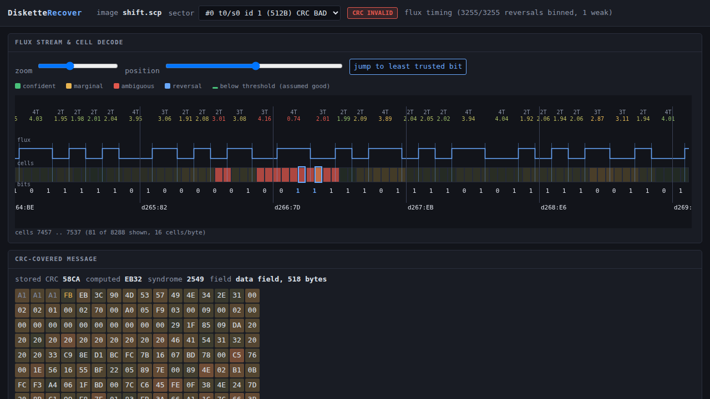

# DisketteRecover

CRC-guided, flux-level repair of floppy disk images, built on the
[HxC Floppy Emulator library](https://github.com/jfdelnero/HxCFloppyEmulator)
(the same `libhxcfe` that the
[Flathub HxCFloppyEmulator app](https://github.com/flathub/fr.free.hxc2001.HxCFloppyEmulator)
ships).

A floppy sector ends in a 16-bit CRC. When that CRC fails, every existing
tool tells you the same thing: *bad sector*. But the disk usually is not
badly wrong - it is slightly wrong, in one or two bit cells, and the raw
flux dump often still says exactly where. DisketteRecover finds that
place, shows it to you at the level of individual flux transitions, and
searches for the smallest, most plausible correction that makes the CRC
come out clean again.

Everything is done through libhxcfe, so the ~100 image formats it reads
and writes come for free, and every repair is verified by re-running
HxC's own decoder over the patched track.

```
$ disketterecover scan   dump.scp        # where are the CRC errors?
$ disketterecover inspect dump.scp       # zoom into the first one
$ disketterecover repair dump.scp        # rank the plausible corrections
$ disketterecover serve  dump.scp        # ...or do it in a browser
```

---

## What it actually does

### 1. Find the first invalid CRC

`scan` walks every track and side, decodes ISO/IBM MFM and FM sectors
through libhxcfe, and reports the address-mark CRC and the data-field CRC
for each one.

```
 idx  trk sd  ord   id  size  enc      hdr-crc  data-crc  data-cell
 ---- --- --  ---  ---  ----  -------  -------  --------  ---------
    4   0  0    4    5   512  ISO/MFM  ok       ok            45344
    5   0  0    5    6   512  ISO/MFM  ok       BAD           55872  <--
    6   0  0    6    7   512  ISO/MFM  ok       ok            66400

1 sector(s) with a CRC error; first is index 5 (track 0 side 0 sector 6)
```

### 2. Show the stream data for that sector

`inspect` (and the browser view) opens the sector's CRC-covered message -
the sync bytes, the data mark, the data, and the stored CRC - and lines
it up against the bit cells and the raw flux transitions underneath.

For every flux interval you get the measured length in cell periods, the
bin the PLL put it in, and how close it came to the boundary between
bins:

```
  bit    byte  role  bitpos  cell    state  interval      bin   margin  p_err   evidence
  2124   265   data  4       7481    0       3.013T/1506  2     0.000   0.49    flux #####
  2127   265   data  7       7487    0       4.161T/2081  3     0.000   0.49    flux #####
  2128   266   data  0       7489    0       0.738T/369   4     0.000   0.49    flux #####
  2130   266   data  2       7493    0       2.012T/1006  3     0.000   0.49    flux #####
```

A 0.738T interval that had to be called a 4T is not a measurement - it is
a guess, and that is where the sector broke.

### 3. Bin the transitions and assign probabilities

Each flux interval is divided by the local cell period and compared with
where a 2T, 3T or 4T interval *actually lands on this track* - which is
not 2.0, 3.0 and 4.0. Two effects move the bin centres:

* the dump's bitrate estimate is never exact, and
* **peak shift** - adjacent reversals repel each other, so a 2T following
  a 4T reads long and the next one reads short.

So the centres are learned rather than assumed, by a robust fit of

```
measured_cells  ~  a + b*bin + c*previous_bin + d*next_bin
```

On a real KryoFlux dump this comes out at `cell = -0.18 + 1.033*bin` with
a residual sigma of **0.075 cells**. Scoring against the ideal 2/3/4
instead would call a sixth of a perfectly good track ambiguous.

Each interval then gets a posterior over the three legal bins,

```
p(bin = k)  =  softmax( -(measured - centre_k)^2 / 2*sigma^2 )
```

and `1 - p(the bin the decoder chose)` is its error probability. That
probability is spread across every cell the interval covers - any of them
could have carried the reversal - and each decoded bit inherits the
combined probability of the two cells that produce it. Cells libhxcfe
flagged as weak are floored at a high probability, unless the flag fires
so widely that it carries no information. Anything below `--threshold` is
**assumed good** and is left out of the search.

The residuals of a real dump are near-Gaussian out to about 4 sigma and
then break cleanly into a separate population of genuine mis-reads, so
that is where the defect detector draws its line.

### 4. Three engines, strongest evidence first

There are several ways to make a sector's CRC come out right, and they
suit different damage. `--mode auto` (the default) tries them in order of
how decisive their evidence is when it applies.

**Restoring the data's own regularity** (`--mode pattern`). Sector data
is very often not random, and it is regular in two different ways, so the
engine fits both and keeps whichever describes the field better.

*Repeats.* A freshly formatted MS-DOS disk is 512 bytes of `0xF6`, an
unused directory block is `0x00` or `0xE5`, a padded tail repeats. When
506 of 512 bytes read `0xF6` and the other six are each `0xF6` with a
single bit missing, Occam has already answered the question and the CRC
only has to confirm it.

*Counters.* Index tables, timing lists, sector maps and directory offsets
are all fixed-size records holding a number that goes up by a constant.
Modelling the record as one integer rather than as independent byte
columns is what makes the carries come out right - and getting carries
wrong is not a small error, it is how a search talks itself into a
thirty-byte answer (see below). Record **alignment** matters as much as
record size: a table of 24-bit counters that starts one byte into the
field looks, column by column, like a bizarre byte permutation; lined up
on its real boundary it is plain little-endian with a constant step.

Either way the engine lists the bytes that break the model and enumerates
by how few of them it has to leave broken. It needs no flux at all, and
when it fires it is by far the most decisive thing available.

**Re-binning the flux** (`--mode rebin`, whenever there are timings and
the track is MFM). Real disks rarely lose a bit outright; they put a
reversal in the wrong bin, and the failure conserves something. See the
next section.

**Bit flips** (`--mode bits`). A CRC is affine over GF(2): flipping
message bit *p* always XORs a fixed mask into the CRC, whatever the data
is. So repairing a sector is finding a set of bits whose masks XOR to the
current syndrome - a hash lookup rather than a re-computation per trial.

* weight 1 and 2 are searched **exhaustively** over the whole field, so
  this works even on images with no timing information at all;
* weight 3 and up enumerate the least trustworthy bits and let the hash
  supply the remaining one;
* the search stops at the first weight that yields a CRC-valid reading;
* every survivor is re-verified by actually recomputing the CRC.

This is the fallback, and the right tool for an isolated error on an
image that carries no other evidence.

Whichever engine runs, its results are re-scored by the same data model
before ranking, so a reading that turns a run of `0xF6` into noise ends
up where it belongs even when its CRC checks perfectly.

### 4a. What MFM's three interval widths actually buy you

MFM writes exactly **three** interval lengths. Between one magnetic
reversal and the next there are 2, 3 or 4 cell periods and nothing else -
4 us, 6 us or 8 us on a 250 kbit/s DD disk. So the flux really is a
ternary symbol stream, and it is tempting to count redundancy from there:
a byte is roughly six intervals, 3^6 = 729 possibilities for 256 byte
values, so surely there is a factor of ~3 of redundancy to exploit.

It is a good instinct, but the arithmetic does not survive contact with
the encoding, and the redundancy that *does* exist is somewhere else -
somewhere more useful.

**A byte is not a fixed number of intervals.** Eight data bits occupy 16
cell periods, and the intervals tiling those 16 cells vary in number:
between four (4+4+4+4) and eight (2 x 8), averaging 16/3 = 5.33. There is
no fixed-length symbol to count.

**The tilings are fewer than the bytes, not more.** There are exactly
**165** ways to tile a 16-cell window with parts of 2, 3 and 4 - fewer
than the 256 values a byte can take. The shortfall is not a paradox: the
tiling of one byte is not independent of its neighbours. The last data
bit of the previous byte decides where this byte's first reversal can
fall, so the mapping is a state machine, not a per-byte code.

**The real combinatorial redundancy is small.** MFM's cell stream obeys
the (d=1, k=3) run-length constraint: at least one and at most three zero
cells between reversals. That constraint has a Shannon capacity of
**0.5515 bits per cell**, and MFM carries exactly 0.5 - so it is 90.7%
efficient, and the spare capacity is only **0.82 bits per byte**. Not a
factor of three. MFM is a *good* code; there is not much slack left in
the symbol alphabet.

**But there is a conservation law, and it is worth far more.** When a PLL
mis-bins an interval it does not lose the time - it takes it from the
next interval. A true (4,2) reads back as (3,3). The pair still spans six
cells. And downstream of the error the byte grid still framed correctly:
the sync was found, the sector ended where it should. So *the cell count
across a disturbed stretch is known*, even when the individual intervals
inside it are not.

That is the constraint DisketteRecover enforces. A candidate re-reading
must

* give every interval a legal length (2, 3 or 4 cells), and
* span exactly the cells the original reading spanned.

Together those two rules cut the search space down enormously - far more
than the 0.82 bits per byte of alphabet redundancy would. On the real
disk below, they take a stretch the decoder read at a timing cost of 1711
nats down to 429, and pin the damage to fifteen specific interval pairs.

The engine also models the two other physical failures, because both
conserve cell count in the same way:

| failure  | what the flux shows              | what the search does        |
|----------|----------------------------------|-----------------------------|
| mis-bin  | adjacent intervals off by +1/-1  | re-bin the pair             |
| dropout  | one interval covers two real ones| split it, at a fixed penalty|
| spurious | two intervals cover one real one | merge them, likewise        |

Each disturbed stretch is solved independently by a shortest-path search
over its legal re-readings, and the stretches are then combined in cost
order and tested against the CRC.

### 5. Cycle through the most likely corrections

Whichever engine ran, the results come back ranked - by the product of
the flipped bits' error probabilities for a bit-flip search, or by how
well the re-reading explains the measured timings for a re-bin. The most
plausible reading is first; `--apply K` takes the Kth.

Press `next candidate` (or `n`) in the browser to step through them; the
flux strip and the hex dump update to show the reading each one implies.

### 6. Write the corrected image back

`apply` patches the bit cells in the track - re-encoding the affected
bytes so the MFM clock cells stay legal - then re-runs libhxcfe's decoder
over the patched track and reports whether the sector now reads clean.
`--out` exports through any libhxcfe writer (`disketterecover formats`),
so you can go back out to HFE, IMG, SCP, IPF, ...

---

## The honest limitations

A 16-bit CRC pins a 512-byte sector down to one part in 65536. A data
field offers a few thousand places to flip a bit, so **alternative
readings that also satisfy the CRC are normal, not exceptional** - a
three-bit error will quite often have a one-bit alias.

DisketteRecover therefore does three things rather than one: it tells you
how much the top candidate wins by, it tells you when the ranking is
meaningless, and it tells you when the CRC simply does not carry enough
information to settle the question.

```
margin    : the top candidate is 1.75e+03 x more likely than the next; clear winner
```

```
budget    : 108 message bit(s) still in doubt across the disturbed region;
            a 16-bit CRC pins down 16, so expect ~5e+27 reading(s) to pass it
```

```
note      : no flux timing in this image, so every bit carries the same prior.
            Candidates of equal weight cannot be told apart; the lowest weight
            is not necessarily the true error. Re-dump as flux (SCP/KryoFlux/A2R)
            to get a real ranking.
```

The ranking is only as good as the evidence. On a sector-level image
(IMG, HFE, ADF) there is no timing to bin, every bit gets the same prior,
and all the tool can offer is "here are the minimum-weight readings".
On a flux dump (SCP, KryoFlux stream, A2R, DFI, MFI, HxC stream, FDX) the
margins are real and an isolated defect is usually resolved by a wide
margin.

Currently supported encodings for repair: **ISO/IBM MFM** (System 34, the
PC/Atari/Amstrad family) and **ISO/IBM FM** (System 3740). Re-binning is
MFM-only. Amiga MFM uses a checksum rather than a CRC-16 and is not
handled yet; nor are the GCR formats.

### A worked case: two real KryoFlux dumps

**Disk 1** - an 84-track dump of a 720K disk, 1440 sectors, two bad:
sector 6 on side 1 of tracks 72 *and* 73. The same sector on adjacent
tracks is the signature of a physical mark rather than a random error.

The flux said the damage was a mess. `inspect` fits the track timing to
sigma 0.075 cells and finds a 70-byte stretch where intervals sit 10 to
16 sigma from any legal bin centre, in adjacent pairs of opposite sign:

```
  cell  6187 (byte 386)  gap 4  meas  2.846  z  -15.82
  cell  6189 (byte 386)  gap 2  meas  3.238  z  +16.03
  cell  6266 (byte 391)  gap 3  meas  3.849  z  +11.25
  cell  6269 (byte 391)  gap 3  meas  2.173  z  -11.63
```

Fifteen such pairs. Re-binning them cuts the region's timing cost from
1711 nats to 429 - a real improvement - but leaves about a hundred bits
in play, and sixteen bits of CRC cannot choose among 2^92 readings. The
flux alone does not settle it.

The data does, instantly:

```
data      : period 1 explains 98.8% of the field (3 distinct values,
            commonest 0xF6 x506)
search    : restoring the repeat - 6 byte(s) break it; 1 reading(s) tested
result    : 1 CRC-valid reading(s) from the data model

 rank  bytes  bits  restore  remove  data evidence  changed bytes
    0      6     6        6       0      37.5 nats  382:76->F6, 383:76->F6,
                                                    391:F2->F6, 398:76->F6, ...
```

506 of 512 bytes are `0xF6` - the MS-DOS `FORMAT` filler - and the six
exceptions are `0x76` and `0xF2`, each `0xF6` with exactly one bit
missing. The whole sector is `0xF6`; the stored CRC `2BF6` confirms it on
the first reading tried. Both sectors, byte-exact, applied and verified
by libhxcfe's own decoder.

**Disk 2** - a 1.44 MB dump, 2882 sectors, nine bad, and this time the
sectors hold real data rather than filler. Three repair uniquely; the
rest stay ambiguous and are reported as such rather than guessed.

The first of them, track 0 side 0 sector 15, is worth following through.
The flux says the damage runs from byte 182 to byte 255 - intervals 10 to
16 sigma from any legal bin centre, a `2.08T` called a 4T next to a
`3.42T` called a 2T. Re-binning narrows it but cannot settle it. The data
is what settles it:

```
data      : 3-byte little-endian records at offset 1 counting by 0x2002,
            over 510 of 512 bytes - explains 97.6% of the field
search    : restoring the repeat - 12 byte(s) break it; 794 reading(s) tested
result    : 1 CRC-valid reading(s) from the data model
budget    : 794 reading(s) were possible; a 16-bit CRC passes ~0.0121 of them
            by chance, so the single survivor is ~98.8% likely to be right

 rank  bytes  bits  restore  remove  data evidence
    0      8    13       13       0      70.0 nats
```

Thirteen bits, every one of them a reversal put back, every one inside
the span the flux independently flagged.

That sector is also where an earlier, sloppier version of this engine
went wrong, and the failure is instructive. Modelling the record as three
independent byte columns made the high byte look constant, so every
legitimate carry looked like an error - 34 outliers instead of 12. Given
34 free bytes, the search duly produced a CRC-valid reading that changed
30 of them, most at the carry points. It was nonsense, and it was
*guaranteed*: 2^34 candidates against a CRC that accepts one in 65536
will always turn something up. **The number that matters is not whether a
reading passes the CRC but how many readings were on offer** - which is
why the tool now reports exactly that.

One of the still-unrepaired sectors is a word-processor document, and
there the data model speaks for itself - the top four candidates all
agree on:

```
byte 218: 0x23 -> 0x63    '#' -> 'c'
  was: "...we are interested in li#ensing the de..."
  now: "...we are interested in licensing the de..."
```

One bit, reading 0 where a 1 was written. The rest of that sector's
damage falls in its binary tail, where nothing constrains the answer.

### The errors that actually happen

Fourteen errors across these two disks have a verifiable truth - eleven
from the all-`0xF6` sectors, three from English prose. **Every one of
them is a 1 read as a 0: a magnetic reversal that was written and not
detected.** None is a spurious reversal, and none is a bit written wrong.

Better still, on Disk 1 all eleven sit at one of two bit positions in the
byte, and those two are exactly the transitions *preceded by a 4T gap*.
If dropouts were spread evenly over the six transitions in an `0xF6`
cell pattern you would expect a third of them there; getting eleven out
of eleven by chance is about one in 180,000. The physics is unsurprising
once stated: an isolated pulse after a long gap is the broadest and
lowest, so it is the first to fall under the detector's threshold on a
weak patch of media.

That gives a usable ranking of causes, most likely first:

| error | mechanism | flux signature | data signature | seen |
|---|---|---|---|---|
| **dropout** | weak pulse misses the threshold, most often after a 4T gap | one interval covers two; the PLL splits it into an implausible pair | a 1 reads as 0 | **14/14** |
| **mis-bin / phase slip** | PLL steals a cell from the next interval | adjacent intervals off by +1/-1, total conserved | usually one bit | the flux face of the above |
| **shift** | transition displaced but still detected | one interval long, the next short | one bit or none | synthetic only |
| **spurious pulse** | noise clears the threshold | two intervals sum to one legal length | a 0 reads as 1 | **0/14** |
| **speed drift** | motor wow, or a different drive | every interval scales together | none, if the PLL tracks | absorbed by the fitted model |
| **weak / fuzzy bits** | deliberate protection, or unmagnetised media | differs between revolutions | not repeatable | none here |
| **burst / erasure** | scratch or contamination | many implausible intervals over a span | many bits | Disk 1's tracks 72-73 |

Across both disks, 27 bit errors now have a verifiable truth and all 27
are reversals that went missing.

Two things follow, and both are built in. `--restore-only` searches only
for reversals to put *back*, which is what the evidence says errors are;
it also cuts a weight-3 search roughly eightfold. And `--dropout-bias`
tilts the ranking that way without forbidding the alternative.

### Ranking: Occam's razor, made explicit

Every engine's candidates are scored the same way, and the CRC is the
weakest term in it:

```
score = data plausibility  +  flux plausibility  +  error-type prior
```

* **data plausibility** - the log-likelihood ratio of the candidate's
  bytes against a model of what this disk's data looks like, learned
  from every sector that reads cleanly. A whole disk is over a megabyte,
  which supports a real order-2 model; a single 512-byte sector does not,
  which is why the model is built disk-wide.
* **flux plausibility** - how well the reading explains the measured
  interval timings, under the fitted bin centres.
* **error-type prior** - restoring a dropped reversal beats inventing a
  spurious one.

A CRC accepts one reading in 65536 by chance. That is plenty when you are
choosing between a few hundred candidates and nothing else to go on, and
useless when a burst puts a hundred bits in doubt. The priors are what
turn "these all pass the CRC" into "this one is the truth", and when they
cannot, the tool says so instead of picking.

## Building

```sh
git clone --recursive https://github.com/stevenggaskill/DisketteRecover
cd DisketteRecover
make
```

`make` builds the pinned HxC submodule (`libhxcadaptor` + `libhxcfe`) and
then the tool. Only a C compiler and make are needed; the browser view is
compiled into the binary.

```sh
make test        # regression suite, builds its images from the HxC samples
```

## Usage

```
disketterecover <command> [options] <image>

commands:
  scan     <image>              list every sector and flag CRC failures
  inspect  <image>              zoomed view of one sector's cells+bytes
  repair   <image>              search for the most likely CRC-valid fix
  damage   <image>              flip data bits on purpose (test images)
  serve    <image>              browser UI for inspect + repair
  convert  <image>              write the image out in another format
  formats                       list libhxcfe export formats

selection:
  --sector N        sector index from `scan` (default: first bad CRC)
  --track T --side S --id R     select by physical address instead
  --all             work through every sector with a CRC error

engine options:
  --mode M          auto | pattern | rebin | bits   (default auto)
                      pattern: restore the repeat the data almost obeys
                      rebin  : re-read the flux under another legal
                               binning of the transitions (MFM + flux)
                      bits   : search bit flips (works without flux)
                    auto tries pattern, then rebin, then bits
  --max-outliers N  pattern engine: bytes allowed off-pattern (24)
  --restore-only    only consider putting dropped reversals back
  --dropout-bias N  nats favouring a restored 1 over a removed one (1.6)
  --bin-budget N    nats of timing cost a re-bin may spend (12)
  --max-ambiguous N refuse to search past this many open intervals (48)
  --max-explore N   cap on re-binning assignments tested (500000)

model options:
  --threshold P     p_err below this is 'assumed good' (default 1e-3)
  --base-perr P     prior error rate with no timing evidence (2e-4)
  --jitter S        flux jitter sigma in cell periods (0.16)
  --max-weight N    deepest error weight to search (3, max 6)
  --max-pool N      how many low-confidence bits to consider (96)
  --max-results N   cap on returned candidates (256)

repair options:
  --apply K         apply candidate K (0 = most likely) and verify
  --auto            apply candidate 0 only when it clearly wins
  --out FILE        write the patched image
  --format NAME     export format for --out (default: HXC_HFE)

other:
  --set NAME=VALUE  override a libhxcfe setting before loading, e.g.
                    --set FLUXSTREAM_PLL_MAX_ERROR_NS=900 (repeatable)
  --json            machine readable output
```

### Repairing a whole disk

```sh
disketterecover repair "Disk 1/track00.0.raw" --all --auto --out fixed.hfe
```

```
 trk/s sect  engine    result
 ----- ----  --------  --------------------------------------------------
  72/1 s6    pattern   1 reading(s), unique  -> APPLIED, verifies clean
  73/1 s6    pattern   1 reading(s), unique  -> APPLIED, verifies clean

2 of 2 repaired and verified
```

`--auto` applies a reading only when it is unique or beats the runner-up
by a hundredfold; everything else is listed and left alone for you to
look at with `inspect` or `serve`.

### KryoFlux, SuperCard Pro and other flux dumps

Point the tool at any file in the set and libhxcfe pulls in the rest:

```sh
disketterecover scan   "Disk 1/track00.0.raw"     # KryoFlux stream set
disketterecover repair "Disk 1/track00.0.raw" --sector 1310
```

`--set` reaches libhxcfe's own decoder settings, which is occasionally
what a marginal dump needs - `FLUXSTREAM_PLL_MAX_ERROR_NS`,
`FLUXSTREAM_PLL_PHASE_CORRECTION_DIVISOR`,
`FLUXSTREAM_BITRATE_FILTER_WINDOW` and friends. They are documented in
`third_party/HxCFloppyEmulator/libhxcfe/sources/init.script`.

### Worked example

```sh
# a flux dump with one transition landing on a cell boundary
disketterecover scan   dump.scp                 # -> sector 0 has a bad data CRC
disketterecover inspect dump.scp                # -> the 0.74T interval at cell 7489
disketterecover repair dump.scp --threshold 5e-3
#   result : 256 CRC-valid candidate(s) at weight 2
#   margin : top candidate 1.75e+03 x more likely than the next; clear winner
#      #0  byte 266 bit 1: 0->1 (p=0.49), byte 266 bit 2: 0->1 (p=0.49)
disketterecover repair dump.scp --threshold 5e-3 --apply 0 --out fixed.hfe
#   applied candidate 0; libhxcfe re-decode says the sector is now CLEAN
```

### Browser view

```sh
disketterecover serve dump.scp          # http://127.0.0.1:842/
```



The strip shows, top to bottom: the bin and measured length of each flux
interval, the reconstructed read waveform, the bit cells shaded by how
confidently they were binned (green under the threshold, red where the
decoder had to guess), the decoded bits, and the byte boundaries. The
candidate currently selected is outlined in blue, with its flipped bits
picked out in the bit row and in the hex dump.

## Making test images

`damage` flips decoded bits on purpose and writes the result out, which
is the quickest way to produce a broken image:

```sh
disketterecover damage good.hfe --sector 5 --bits 803 --out broken.hfe
```

For a defect that is genuinely at the flux level - a transition sitting
between two cells, so the PLL has to guess - `tests/tools/scp_jitter.py`
adds position jitter to a SuperCard Pro dump and can displace a chosen
transition:

```sh
disketterecover convert good.hfe --out good.scp --format SCP_FLUX_STREAM
python3 tests/tools/scp_jitter.py good.scp broken.scp \
        --sigma 90 --shift 0:3000:1.3
```

## Layout

```
src/dr_core.c     image load/save, sector scan, cell encode/decode
src/dr_view.c     the zoomed view: cells, flux bins, confidence model
src/dr_flux.c     realigning the cell stream with the raw pulse list
src/dr_repair.c   the GF(2) CRC bit-flip search and the patcher
src/dr_rebin.c    the flux re-binning list decoder
src/dr_pattern.c  the data model: regularity, and the disk-wide byte model
src/dr_crc.c      CRC-16/CCITT and its per-bit linear masks
src/dr_json.c     JSON for the CLI and the viewer
src/dr_http.c     the built-in HTTP server
web/index.html    the browser view (compiled into the binary)
```

## Licence

GPL-2.0-or-later, matching libhxcfe. HxC Floppy Emulator is
copyright (C) 2006-2026 Jean-François DEL NERO.
